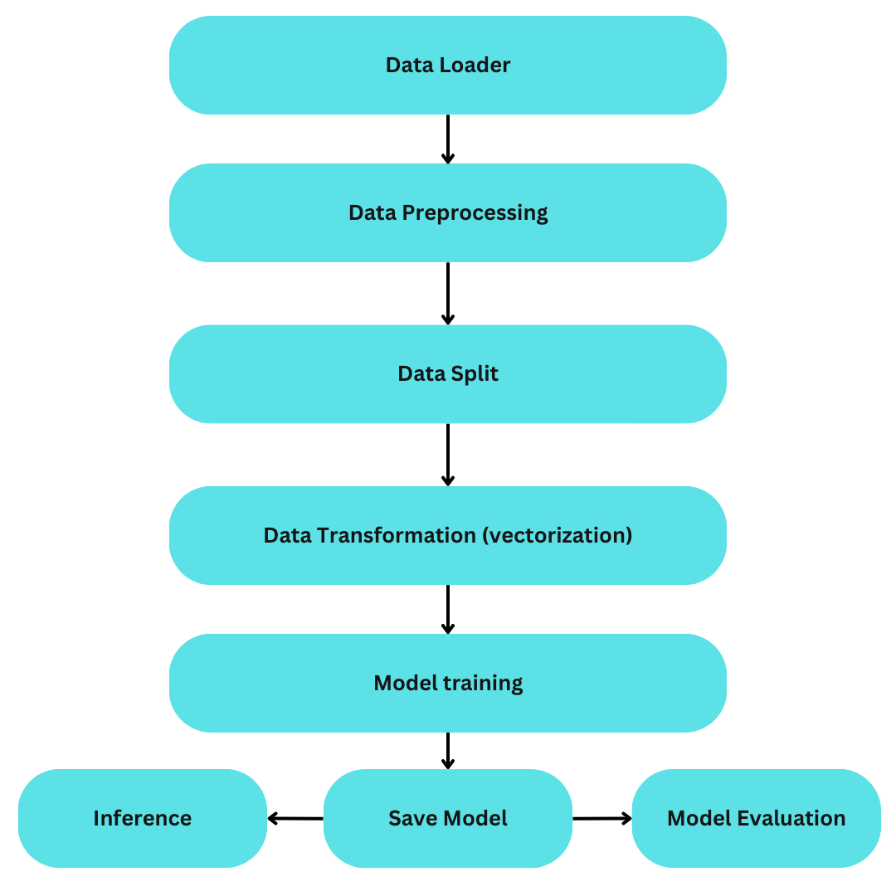
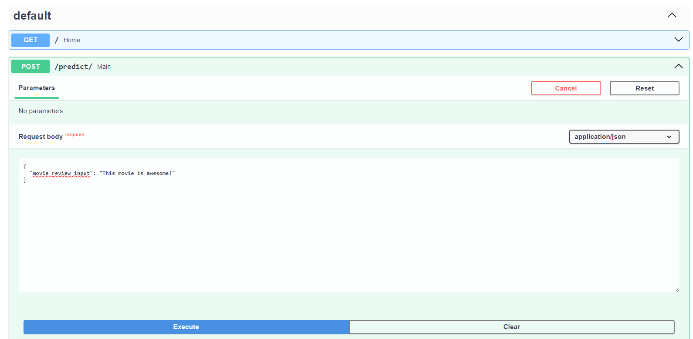
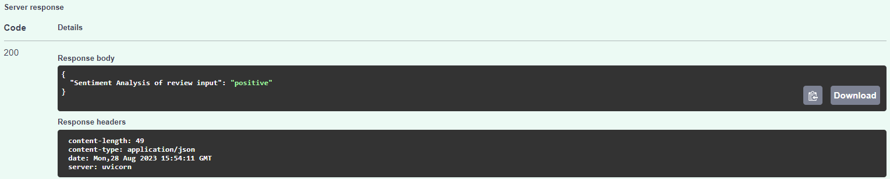

# Problem Statement: Movie Sentiment Analysis for Improving User Experience

## Background:
In today's digital age, movies are widely consumed across various platforms, including theaters, streaming services, and television. Understanding how viewers perceive movies is essential for movie producers, studios, and streaming platforms to make informed decisions about content creation, marketing strategies, and user engagement. Sentiment analysis, a subfield of natural language processing (NLP), offers a valuable tool to gain insights into viewers' opinions and sentiments related to movies.

## Problem:
The problem at hand is to develop a sentiment analysis system that can automatically determine the sentiment expressed in movie reviews or comments. The sentiment could be positive or negative. The goal is to create a model that accurately classifies the sentiment of a given text review, contributing to better understanding viewer preferences and enhancing user experience.

## Proposed Solution
Support Vector Machines (SVMs) are a popular machine learning algorithm that can be effectively used for solving sentiment analysis problems like the one described. SVMs are a type of supervised learning algorithm that can perform classification tasks by finding a hyperplane that best separates data points of different classes.

Before using SVMs, the text data needs to be transformed into a format that can be understood by the algorithm. This involves converting the text into numerical features. Here TF-IDF (Term Frequency-Inverse Document Frequency) was used to assign weights to words based on their frequency in the document and inverse frequency across all documents.

## Pipeline Summary

## SVM Model Training:
SVMs aim to find a hyperplane that maximizes the margin between two classes of data points. In the context of sentiment analysis, the classes are "positive sentiment" and "negative sentiment". The SVM algorithm searches for the hyperplane that best separates the feature vectors of these two classes while maintaining the largest possible margin between them. This hyperplane is used to classify new, unseen text data.

## Inference via fastapi:
Once the SVM model is trained, it can be used to predict sentiment labels for new, unseen movie reviews or comments.

## To build docker image for inference with Fastapi for model serving
`docker build -t movie_sentiment_analysis .`

## run docker image for inference 
`docker run -p 80:80 movie_sentiment_analysis`

## How to run Fastapi, post request

1. Click on port: Container on docker desktop: 
2. On browser, `{"health_check":"OK","model_version":"0.1"}` should be seen.
3. Go to http://localhost/docs
4. Under POST, submit a request buy pressing 'Try it out'. 
5. Under Server response, the prediction output can be seen. 

## To terminate Docker container process
`ctrl + c in terminal or stop the process in docker desktop`